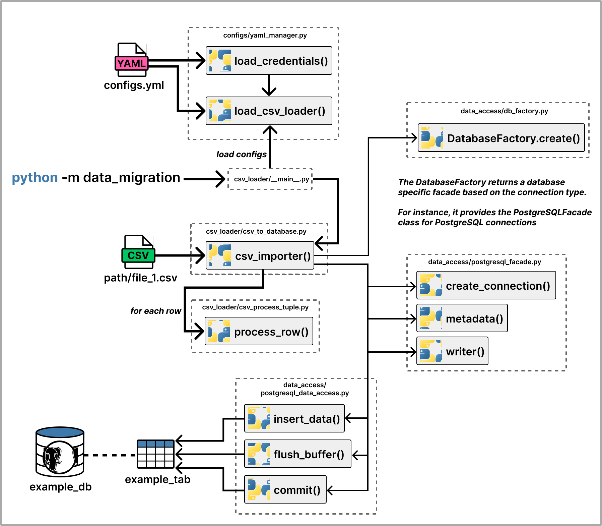
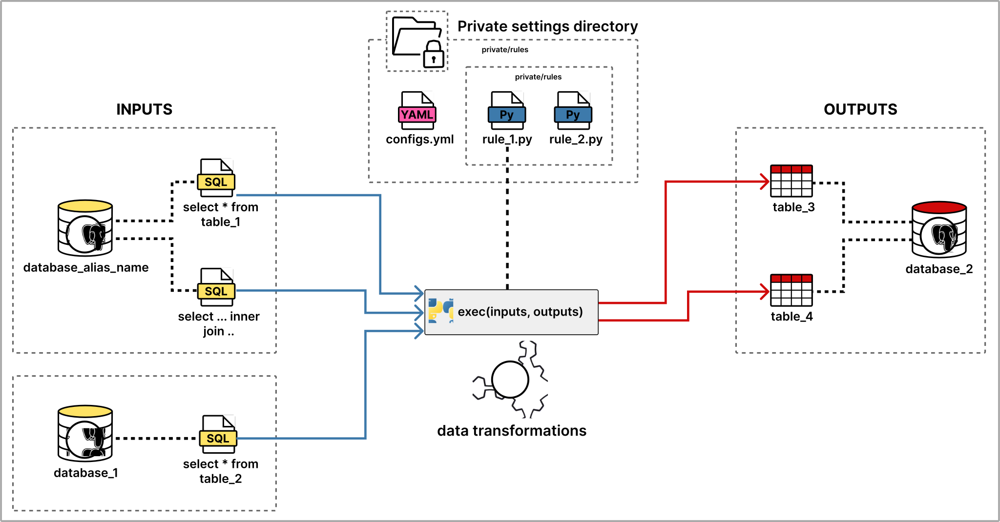

# Project name??

An open-source set of modules for database migration.  

- **configs**: Loads configuration settings from the `config.yml` file.  
- **csv_loader**: Imports data from CSV files into a database.  
- **data_access**: Collection of routines for database access.  
- **data_quality**: Collection of routines for detecting and resolving data quality issues.  
- **data_migration**: Collection of routines for performing database migration.  
- **system_log**: Module responsible for generating execution logs.  


## Getting Started  

To ensure data privacy and prevent the exposure of sensitive database information, the system restricts access to such details. All sensitive data must be stored within a designated directory.  

1. Create a directory named `private`.  
2. Inside this directory, create a file called `configs.yml`. You can use `configs-example.yml` as a reference.
3. Create a directory named `rules` inside the `private` folder, where the mapping rules between the migrated tables will be defined.

```
private/
│── rules/
│   │── rule_1.py
│   │── rule_2.py
│── configs.yml
```

Once all components are configured in the configs.yml file, you can invoke each module individually using the following commands:

```bash
cd mapas_migration
```
To run the CSV loading module: 
```bash
python -m csv_loader
```

To run the migration module:
```bash
python -m data_migration
```

Below, we detail each module and how to use them.   


# Database Connection Configuration  

The `databases_connections` section defines the connection details for **multiple databases**. Each connection is identified by an **alias name** and includes the necessary credentials and settings to establish a connection.  

### Example Configuration

```yaml
databases_connections:
  database_alias_name:
    host: localhost
    port: 5432
    user: your_username
    database: your_database
    password: your_password
    schema: public
    type: postgresql
  
  another_database:
    host: localhost
    port: 5432
    user: your_username
    database: your_database
    password: your_password
    schema: your_schema
    type: postgresql
```

### Usage example

If needed for some implementation, credential data from the file can be easily retrieved using:

```python
from configs.yaml_manager import load_credentials

# Load database credentials from the configuration file
credentials = load_credentials()

database_alias_name = credentials["database_alias_name"]

print(database_alias_name.user)   # your_username
print(database_alias_name.schema) # public
```


# System Logging Configuration  

The `system_logging` section in the `configs.yml` file allows multiple logs to run simultaneously.  

### Example Configuration  

```yaml
system_logging:
  console_log:
    levels:
      - INFO
      - ERROR
      - WARNING
      - DEBUG
```

By default, there is a simple log implementation called `console_log`, which uses Python's `print` function to record messages. It is defined in the following class:

```python
class ConsoleLog:
    def __init__(self, levels):
        self.levels = levels

    def record(self, level, msg):
        if level in self.levels:
            print(f"[{level}] {msg}")
```

This setup allows filtering log levels as needed. For example, to hide all DEBUG messages, simply comment out that option in the configuration file:

```yaml
system_logging:
  console_log:
    levels:
      - INFO
      - ERROR
      - WARNING
      # - DEBUG
```

### Usage example

```python
from system_logging.log_manager import log, Level

log(Level.DEBUG, 'debug message')
log(Level.ERROR, 'error message')
```


# CSV Loader  

The CSV Loader is a configurable module designed for bulk-loading CSV files into a target database. It allows defining multiple CSV files, specifying target tables, and applying optional transformations such as value replacements.

### Example Configuration  

```yaml
csv_loader:
  target_database: example_db
  buffer_size: 10000
  bulk_commit: false
  csv_files:
    - path: path/file_1.csv
      target_table: example_table

    - path: path/file_2.csv
      target_table: another_table
      replace_columns_values:
        column_1: '[private_data]'
        column_2: '[private_data]'
      delimiter: ','
      quotechar: '"'
      encoding: utf-8
```

- `target_database:` alias name of the target database defined in the databases_connections section.

- `buffer_size:` Defines how many records are buffered before insertion.

- `bulk_commit:` Determines whether inserts should be committed in bulk.

- `csv_files:` List of CSV files with individual configurations.

    - `path:`Path to the CSV file.

    - `target_table:` Target table where data will be inserted.

    - `replace_columns_values:` (Optional) Define columns that can be replaced with default values. Making anonymization easier.

    - `delimiter:` (Optional) Character used as a delimiter in the CSV file.

    - `quotechar:` (Optional) Character used to enclose string values.

    - `encoding:` (Optional) Encoding of the CSV file.


### Usage example

To execute the CSV Loader, run:

```bash
python -m csv_loader
```
This will process the CSV files as per the specified configuration in `config.yml` file.

### Internals

The diagram below illustrates the simplified flow of the **CSV Loader**:



1. **Initial Execution**  
   The module starts from the `csv_loader/__main__.py` file. At this point, database credentials and loader configurations are loaded using the following functions:  
   - `load_credentials()`: Loads the credentials required to connect to the database.  
   - `load_csv_loader()`: Reads and interprets the `config.yml` file, retrieving details about the CSV files and `target_database`.

2. **CSV File Processing**  
   Once configurations are loaded, the system calls the main function:  
   - `csv_importer()`: Iterates over each CSV file listed in the configuration file and processes all its tuples.

3. **Data Handling**  
   For each row read from the CSV, the following function is executed:  
   - `process_row()`: Applies necessary data transformations before insertion into the database.

4. **Database Connection**  
   The system uses a factory to establish a connection with the target database:  
   - `DatabaseFactory.create()`: Creates a facade to interact with the database. Depending on the database type, a specific implementation is returned.  
   - For PostgreSQL, the factory returns a `PostgreSQLFacade` object, which provides the following functions:
     - `create_connection()`: Opens a connection to the database.  
     - `metadata()`: Retrieves columns from the target table for comparisons with the CSV columns.  
     - `writer()`: Responsible for inserting data using the function:  
       - `insert()`: Inserts the processed tuples into the target table.

5. **Finalization and Commit**  
   After data insertion, two functions ensure that the operation is properly finalized:  
   - `flush_buffer()`: Ensures that all buffered data is sent to the database.  
   - `commit()`: Confirms the transaction in the database, making the data persistent.


# Data Migration

The Data Migration module is designed to facilitate the transfer of data between databases using SQL queries. It enables defining multiple input queries and specifying target tables for insertion. The source and destination databases must be configured in the databases_connections section of the `config.yml` file.

### Example Configuration  

```yaml
data_migration:
  buffer_size: 10000
  bulk_commit: false
  rules:
    rule_1:
      inputs:
        database_alias_name:
          - select * from table_1
          - select ... inner join ..
        database_1:
          - select * from table_2
      outputs:
        database_2:
          - table_3
          - table_4
```

- `buffer_size`: Defines how many records are buffered before insertion.

- `bulk_commit`: Determines whether inserts should be committed in bulk.

- `rules:` Defines data migration rules, each specifying queries (inputs) and target tables (outputs).

  - `inputs:` Lists databases and their corresponding SQL queries to extract data.
  - `outputs:` Specifies the destination database and the target tables for inserting the extracted data.


Each migration rule is defined as a Python file inside the `private/rules` directory. Each rule must implement a function named `exec(inputs, outputs)`, where inputs contain the extracted data from SQL queries, and outputs define the target tables for insertion. Multiple rules can be created to handle different migration scenarios, enabling flexible and modular data transformations.

Example: `private/rules/rule_1.py`

```python
def exec(inputs, outputs):
```

The diagram below illustrates the definition of `rule_1` presented in the configuration example.



### Usage example

Ensure that the `config.yml` file is properly configured before running the migration, as the following command will execute the migration based on the specified settings:

```bash
python -m data_migration
```

### Reading data from an input

```python
def exec(inputs, outputs):
    
    input = inputs[0] # select first input
    
    input.create_connection()
    reader = input.reader()
    for row in reader:
        print(row) # print each row result from the query
```

### Writing data to an output

```python

def exec(inputs, outputs):
    
    output = outputs[1] # select first output
    output.create_connection()
   
    writer = output.writer()
    writer.insert([21, "column_data_1", "column_data_2", 2502.1])
    
    writer.flush_buffer() # flush the buffer
    writer.commit() # do not forget to commit the changes
   
```